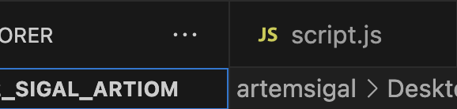
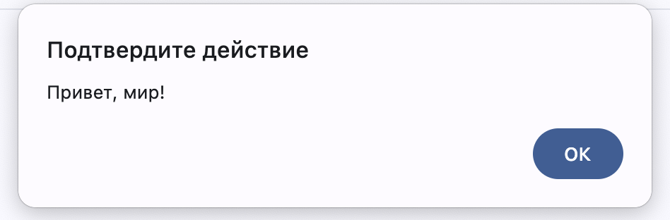
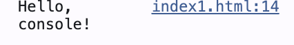
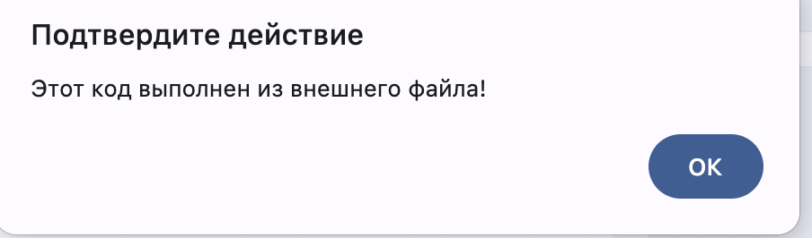
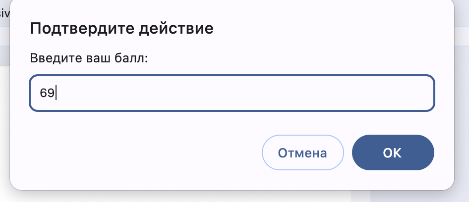
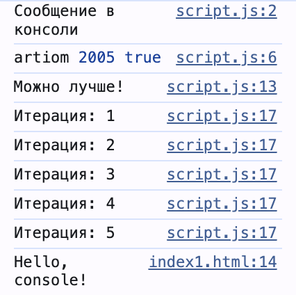

## Запуск первой лабораторной работы 
- **Открыть файл:** `index.html`
-  **Доступ к консоли:** Вызвал инструменты разработчика через `F12` или выбрав в контекстном меню пункт `Посмотреть код`

## Цель:
Разобраться с основами `JavaScript`, написать и протестировать код в браузере.

## Содержание
- Выполнение заданий

  1. [Задание 1](#задание-1)
  2. [Задание 2](#задание-2)
- [Контрольные вопросы](#контрольные-вопросы)
- [Список используемых материалов](#использованные-источники)

## Задание 1

**Подготовка среды:**
- Установил текстовый редактор `VS Code`.
- Открыл в VS Code `JS` файл.
  


**Выполнение кода JavaScript**

  - Создал файл `index1.html`, добавил в него следующий код:

   ```html
   <!DOCTYPE html>
   <html lang="en">
     <head>
       <title>Привет, мир!</title>
     </head>
     <body>
       <script>
         alert("Привет, мир!");
         console.log("Hello, console!");
       </script>
     </body>
   </html>
   ```

   - Открыл страницу в браузере и посмотрел, как выполняется код.

  
  

**Подключение внешнего JavaScript-файла**

  - Создал `script.js` и записал в него:

       ```javascript
       alert("Этот код выполнен из внешнего     файла!");
       console.log("Сообщение в консоли");
       ```

    - Подключил `script.js` в index.html, добавив в `<head>`:

       ```html
       <script src="script.js"></script>
       ```

    - Запустил страницу в браузере, проверил работу скрипта.
      
       

## Задание 2
**Работа с переменными и типами данных**

   - В файле `script.js` создал несколько переменных:

     - `name` - строка с именем
     - `birthYear` - число, год рождения
     - `isStudent` - логическая переменная (являетесь ли студентом)

   - Вывел их в консоль.

**Условия и циклы**

   - Добавил код для обработки пользовательского ввода в `script.js`:

   ```javascript
   let score = prompt("Введите ваш балл:");
   if (score >= 90) {
     console.log("Отлично!");
   } else if (score >= 70) {
     console.log("Хорошо");
   } else {
     console.log("Можно лучше!");
   }

   for (let i = 1; i <= 5; i++) {
     console.log(`Итерация: ${i}`);
   }
   ```

   - Запустил страницу в браузере, проверил выполнение условий и цикла.

  
  

## Контрольные вопросы
1. Переменные
 - `var` - устаревший способ объявления, переменная доступна во всей программе.
 - `let` - используется для создания изменяемых переменных.
 - `const` - бъявляет константу, значение которой нельзя менять.

 2. `Неявное преобразование`  - автоматическое изменение типа данных, например, при выполнении `let result = "10" - 5`;.

 3. `==` - сравнивает значения, игнорируя тип данных. 
    
    `===` проверяет не только значение, но и его тип.
    ```javascript
     console.log(5 == "5");   // true — неявное преобразование строки в число
     console.log(5 === "5");  // false — строгое сравнение без преобразования
    ```

## Использованные источники
- [GitHub](https://gist.github.com/asabaylus/3071099#start-of-content)
- [MoodleUSM](https://moodle.usm.md/mod/page/view.php?id=300750)
- [JavaScript.info](https://javascript.info/)

